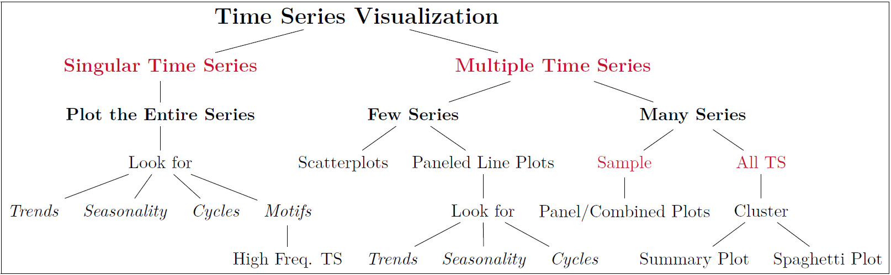

```{r setup, include=FALSE}
knitr::opts_chunk$set(echo = TRUE,
                      warning = FALSE,
                      message = FALSE,
                      cache = FALSE,
                      progress = FALSE, 
                      verbose = FALSE,
                      dpi = 600,
                      dev = 'png',
                      out.width = '100%')
```

# Required Packages
In this section, we will include all the packages used in our analysis. In class, we will add to the packages listed in this template document. As we have done throughout the semester, we will use the [pacman package](https://cran.r-project.org/web/packages/pacman/pacman.pdf) to load (and install if needed) any of the packages. For students who continue to have issues with package installation, I would suggest:  

  - Use R on the FSB virtual Desktop  
  - Try installing the packages with the [pak package](https://github.com/r-lib/pak), which will consist of the following steps:  
    - Step 1: Install the pak package, which can be done using either `pacman::p_load(pax)` or `install.packages('pak')`.  
    - Step 2: Use the `pak::pkg_install("usethis") # package name of interest in quotes` to install the package that you need.  
    - Step 3: Once you installed all the packages, you can use `pacman::p_load()` to load them

```{r packages}
if(require(pacman) == FALSE) install.packages('pacman') # check and install pacman if needed
pacman::p_load(tidyverse, # load the tidyverse package for ggplot2 and dplyr functions
               scales, # we sometimes use this for pretty_breaks() or the commas() with ggplot2
               magrittr, # for pipe based operators
               lubridate, # we use this to fix dates
               readxl, # to read the excel_file for the German Forecasts dataset
               GGally, # to create the scatterplot matrix
               tidyquant) # we use tidyquant to get stocks and economic data

# if you cannot install tidyquant, you should remove it from line 46, remove the comma in line 45 and
# ensure that the # comment is after the )
if(require(tidyquant)==FALSE) source('https://raw.githubusercontent.com/fmegahed/businessForecasting/master/custom_functions/tq_get.R')

```

---

# Time Series Plots (Continued from Last Class)

For your convenience, I am summarizing some important concepts that we have discussed before in the next subsection. This is followed by a discussion of different multivariate charts. 

## A Refresher on Important Concepts

The grammar of graphics is a **framework** which follows a **layered approach** to describe and construct visualizations or graphics in a structured manner. It was introduced by [Leland Wilkinson](https://link.springer.com/book/10.1007/0-387-28695-0) and has inspired the development of the [ggplot2 package](https://ggplot2.tidyverse.org/) in R. In this course, we will often use the `ggplot2::ggplot()` to create graphs.

> "ggplot2 is a system for declaratively creating graphics, based on The Grammar of Graphics. You provide the data, tell ggplot2 how to map variables to aesthetics, what graphical primitives to use, and it takes care of the details."

```{r ggplotWebFigures, echo=FALSE, out.width="48%", fig.show='hold'}
# Note the following commands in the code chunk info:
# echo = FALSE  prevents the printing of the code
# out.width ='48%', makes the width of each figure outputted to be less than half the width of the page (i.e. as a first step to put both figures side by side)
# to complete putting figures side by side, I set fig.show='hold' (i.e. print all figures at the same time)

# The include_graphics() allows us to include images in R (whether they are locally stored or on the web)
knitr::include_graphics(c("https://www.ericchowkokyew.com/wp-content/uploads/2019/07/image-2.png",
                          "https://englelab.gatech.edu/useRguide/images/dataviz/ge_all.png"))
``` 

In today's class, we will continue to utilize the framework listed in [Slide 4 of our Class 04 notes](https://miamioh.instructure.com/courses/142177/files/18997183?module_item_id=2905745) to construct multiple charts in R. **Today, we will discuss approaches for the multivariate case. Note that these approaches are representative of some techniques that you may consider.**

```{r embedForestOutputinR, echo=FALSE, out.width = '90%'}
# Url of the Figure on my GitHub
url1 = 'https://github.com/fmegahed/businessForecasting/blob/master/lectures/03%20-%20Basic%20Tools%20for%20Time%20Series%20Analysis/Figures/snapshot_of_forest_output.png?raw=true'

# Downloading the figure to your computer and including it in the R Markdown
download.file(url1, destfile = 'snapshot_of_forest_output.png', mode = 'wb')

```


## Scatterplots
Using the [GermanForecast Data](https://www.wessexlearning.org/pobf2e/dsa/German_forecasts.xlsx), let us create scatterplot in R. As a reminder, a scatterplot involve plotting two variables, one on each axis of the chart.  

```{r germanDataScatter}
download.file('https://www.wessexlearning.org/pobf2e/dsa/German_forecasts.xlsx',
              destfile = 'German_forecasts.xlsx', mode = 'wb')
german = read_excel('German_forecasts.xlsx')

german %>% ggplot(aes(x = Govsurp, y = GDP)) +
  geom_point() + theme_bw()
```

## Scatterplot Matrix

> A scatter plot matrix is a grid (or matrix) of scatter plots used to visualize bivariate relationships between combinations of variables. Each scatter plot in the matrix visualizes the relationship between a pair of variables, allowing many relationships to be explored in one chart. -- [ArcGIS Pro Documentation](https://pro.arcgis.com/en/pro-app/latest/help/analysis/geoprocessing/charts/scatter-plot-matrix.htm#:~:text=A%20scatter%20plot%20matrix%20is,be%20explored%20in%20one%20chart.)

The process of creating a scatterplot matrix in R is very simple. We will utilize the `ggpairs()` from the [GGally package](https://cran.r-project.org/web/packages/GGally/GGally.pdf) to create the scatterplot matrix in R. For our demo, we will continue to use the [GermanForecast Data](https://www.wessexlearning.org/pobf2e/dsa/German_forecasts.xlsx), and we will construct the plot based on the 2<sup>nd</sup>, 4<sup>th</sup>, 6<sup>th</sup>, and 8<sup>th</sup> columns in the data frame.


```{r germanScatterPlotMatrix}
german %>% ggpairs(columns = c(2, 4, 6, 8, 9)) + theme_bw()
```


### Spaghetti and Summary Plots
For the purpose of time, we will not recreate the spaghetti and summary plots in class (primarily since our class focuses on univariate time series data). You are encouraged to learn their code by visiting [this GitHub Page](https://fmegahed.github.io/covid_analysis_final.html), where my collaborators and I have documented the entire analysis that we performed for COVID-19 data.


```{r stocks}
stocks = tq_get(c('AAPL', 'AMZN' , 'FB', 'GME', 'ORCL', 'AMC', 'MCD', 'NKE', 'SLV', 'PENN',
                  'TSLA', 'GE'))
stocks %>% ggplot(aes(x = date, y = adjusted, group = symbol)) +
  geom_line(size = 0.2, alpha = 0.1) +
  stat_summary(aes(group = 1), fun = median, color = 'red', geom = 'line', size = 1.25)
```

---


# Summarizing Time Series Data

To illustrate the concepts discussed in class, let us examine the stock prices for GameStop (GME) from September 01, 2020 up to January 31, 2021. We will compute the following measures, on the adjusted closing price:  

  - The **mean** adjusted closing price  
  - The **median** adjusted closing price  
  - The **mean absolute deviation (MAD)** for the adjusted closing price, capitalizing on: `MAD = function(x){ return( mean( abs(x-mean(x)) ) ) }`  
  - The **variance** in the adjusted closing price  
  - The **standard deviation** in the adjusted closing price

Our calculations will be performed: (a) **across** all months, and (b) **by/within** each month.

```{r gmeSummaries}
# custom function
MAD = function(x){ return( mean( abs(x-mean(x)) ) ) } # needed because the function is not in a package

gmeANDamc = tq_get(c('GME', 'AMC'), from = '2020-09-01', to = '2021-01-31')

gmeANDamc %>% group_by(symbol) %>% summarise(meanACP = mean(adjusted),
                                             medianACP = median(adjusted),
                                             madACP = MAD(adjusted),
                                             varACP = var(adjusted),
                                             sdACP = sd(adjusted) )
gmeANDamc$MONTH = month(gmeANDamc$date, label = TRUE)
gmeANDamc$YEAR = YEAR(gmeANDamc$date) # added this bec when I printed it out it had Jan as the first row (and I want it after Dec)

gmeANDamc %>% group_by(symbol, YEAR, MONTH) %>% summarise(meanACP = mean(adjusted),
                                             medianACP = median(adjusted),
                                             madACP = MAD(adjusted),
                                             varACP = var(adjusted),
                                             sdACP = sd(adjusted) )
```


---


# Transformations


## Differencing
The change in the time series from one period to the next is known as the (first) difference.   

  - Mathematically speaking, it can be computed as follows:  $DYt = Yt − Yt−1$  
  - In R, it can be computed through either:  
    - Lag the time-series, and then subtract the lag from $Y_t$; or   
    - Using the `diff()` from base R. 
  - **Note that you should choose a $lag \ne 1$ if the time series exhibits a seasonal pattern.** In such a case, your lag should equal to the frequency of the time series.


```{r diffs}
sp500 = tq_get('SPY', from = '2021-01-25', to ='2021-01-30')

sp500 %<>% mutate(`Yt-1` = lag(adjusted),
                  `DYt-1` = adjusted -`Yt-1`)

sp500 %<>% mutate(diffAlt = c(rep(NA, 1), diff(adjusted)) ) 
```


```{r seasonalDiffs}
retailSales = tq_get('RSCCASN', from = '2015-01-01', get = 'economic.data')

retailSales %<>%  mutate( diffs = c( rep(NA, 12), diff(retailSales$price, lag = 12) ) )

```

## Growth Rates
Using what you have learned in class, please compute the growth rate for [questions 1 and 2 on Canvas](https://miamioh.instructure.com/courses/142177/quizzes/368225).


## Log Transform
To ensure that you have a good understanding of the log transformation, you are expected to replicate the charts in [Slides 39-41 of our Class 04 Notes](https://miamioh.instructure.com/courses/142177/files/18997183?module_item_id=2905745). Depending on time constraints, I may walk you through one of them as an example.  


---
