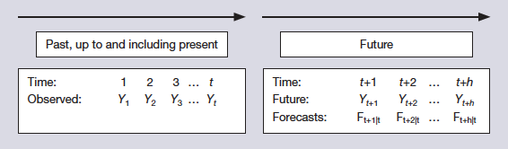

```{r setup, include=FALSE}
knitr::opts_chunk$set(echo = TRUE,
                      warning = FALSE,
                      message = FALSE,
                      verbose = FALSE,
                      progress = FALSE,
                      fig.align = "center",
                      fig.pos = 'p',
                      fig.width = 5.8,
                      fig.height= 2.9,
                      allowframebreaks = TRUE,
                      fig.margin=TRUE,
                      kable.force.latex = TRUE,
                      cache = TRUE)
options(kableExtra.latex.load_packages = FALSE)
pacman::p_load(kableExtra, tidyverse, tidyquant, xtable)
```

# Preface


### Quick Refresher based on Last Class

\begin{block}{\textbf{Main Learning Outcomes}}
	 $\quad$ \textcolor{darkgreen}{\large \checkboxFadel}	\textbf{Apply transformations to a time series.} \\
	 $\quad$ \textcolor{darkgreen}{\large \checkboxFadel}	\textbf{Apply and interpret measures of forecast accuracy.} \\
	 $\quad$ \textcolor{darkgreen}{\large \checkboxFadel}	\textbf{Interpret prediction intervals for a simple forecast.} \\
\end{block}

### Learning Objectives for Today's Class

\begin{block}{\textbf{Main Learning Outcomes}}
  \begin{itemize}
			\item \textbf{Describe the benefits and drawbacks of judgmental and quantitative forecasting methods.}
			\item \textbf{Explain the difference between causal and extrapolative forecasting.}
			\item \textbf{Describe and apply forecasting with a cumulative average.}
			\item \textbf{Describe and apply forecasting with a moving average.}
	\end{itemize}
\end{block}


# Judgemental vs Quantitative Forecasts 

### Definitions

**Judgmental Forecasting:** The process of producing forecasts based on purely subjective information. The integration of subjective information may be made informally or through a structured process. The forecasts may also be obtained by aggregating the subjective forecasts of a number of individuals. 


**Quantitative Forecasting:** Forecasting based on the application of an explicit analysis of numerical data. This kind of forecasting may be extrapolative, causal, or a blend of both.\footnotemark  

  - *Causal Forecast:* a dependent variable is forecast using explanatory variables. 
  - *Extrapolative:* a dependent variable is forecast using only the past values of the dependent variables. The future is “extrapolated” from the past.


\footnotetext{Definitions are based on \href{https://miamioh.edu/fsb/directory/?up=/directory/farmerl2}{Dr. Allison Jones-Farmer's} lecture notes, Miami University, Spring 2020.}


### Some Potential Drawbacks for Judgmental Forecasts

When using judgmental forecasts, forecasters may succumb to:    

  - An **availability bias**, when the forecaster relies too heavily on easily available and memorable information.  
  - The **representativeness heuristic**, when the forecaster matches a situation to a similar earlier event without taking into account its frequency of occurrence.    
  - The **anchoring** and **adjustment heuristic**, when the forecaster uses (anchors onto) an initial value such as the last observation and then adjusts the value to give a revised forecast.  
  - Over-optimism or **motivational bias** when the forecaster is motivated to bias the forecast towards a preferred state.


*These biases can lead to invalid forecasts; they may lead to poor decision making, particularly when combined with overconfidence in their beliefs as to the accuracy of their forecasts.* \footnotemark

\footnotetext{Slide adapted from \href{https://miamioh.edu/fsb/directory/?up=/directory/farmerl2}{Dr. Allison Jones-Farmer's} lecture notes, Miami University, Spring 2020.}


### Representative Methods

\begin{figure}
		\centering
		\includegraphics[width=\linewidth, trim = {1in 9.25in 0.5in 0.25in}, clip, frame]{Figures/forest.pdf}
		\caption{Example techniques used in judgemental and quantitative forecasts.}
\end{figure}


### Big Picture

The remainder of this course focuses on Quantitative Forecasting

  - Chapters 3, 4, 6 focus on Extrapolative Forecasting techniques.
  
  - Chapter 7-8 Focus on Causal (regression-based) Forecasting techniques.
  
  - At the end of the semester we will briefly learn how to blend Extrapolative and Causal Forecasting techniques.


# Causal vs Explarotive Forecasts 

### Causal Models [1]

- Causal methods use data from **sources other than the series being predicted**.

- If $Y$ is the phenomenon to forecast and $X_1, \, X2, \, \dots, \, X_n$ are the $n$ variables we believe to be related to $Y$, then a causal model is one in which the forecast for $Y$ is some function of these variables:  $Y = f(X_1, \, X2, \, \dots, \, X_n)$.  

- Econometric models are causal models in which the relationship between $Y$ and $X_1, \, X2, \, \dots, \, X_n$ is linear.  That is:
\begin{equation*}
    Y = a_o + a_1X_1 + a_2X_2 + \dots +  a_nX_n
\end{equation*}
$\text{for some constants } a_1, \, a_2, \, \dots, \, a_n$


### Causal Models [2]

\begin{figure}
  \centering
  \href{https://www.youtube.com/watch?v=0i_M3Bd_7Ao&ab_channel=TED-Ed}{\includegraphics[width=\linewidth, height = 0.8\textheight, keepaspectratio]{nateSilver}}
\end{figure}


### Extrapolative Methods: A General Framework

Some **forecasting methods** we will discuss use the values of the series to extrapolate into the future. These **extrapolative methods** often work well for short term forecasts.




### Extrapolative Methods: Rolling Origin

**Rolling Origin Forecasts:** The closer you are to the forecast horizon, the better the forecast. Often, as you gain more information, you update the forecast.

**Example:** 

- On Sunday, you might forecast the weather for the entire week ahead: Monday, Tuesday, Wednesday, Thursday, Friday, Saturday. 

- Monday is pretty accurate, but by the time you get to Saturday’s forecast, it is not so accurate. 

- Once Monday comes, you update the forecast, now forecasting Tuesday-Sunday. 

- When Tuesday comes, you will update, and forecast Wednesday-Monday. 

- This is a rolling origin forecast.


# Forecasting/Smoothing with Means

### Cumulative Average {.allowframebreaks}

If you have a series that stays pretty constant over time, you could just
constantly update the mean as you gain more information.

```{r usdEURO, echo=FALSE, results='asis'}
pacman::p_load(tidyquant, tidyverse, magrittr, xtable)
usdEURO = tq_get("USDEUR=X", from = "2020-08-03") %>% select(date, adjusted)

usdEURO %<>% mutate(cuMean = cummean(adjusted))

df = usdEURO
df$date %<>%  as.character()
print(xtable(df[1:15,], align = c(rep('c', 4)), digits = c(0, 0, 4, 4) ), comment = FALSE, size = '\\scriptsize', 
      include.rownames=FALSE)

ggplot(usdEURO, aes(x = date)) + 
  geom_line(aes(y = adjusted, color = 'adjusted')) + 
  geom_line(aes(y = cuMean, color = 'cuMean')) +
  theme_bw() + labs(x = '2020', y = 'USD/EURO', title = 'Smoothing using Cumulative Mean', caption = 'Data from Yahoo finance, extracted on 2020-09-09')
```


### Moving Averages {.allowframebreaks}
If you have a series that stays pretty constant over time, you could just
constantly update in a rolling window fashion.

```{r usdEURO2, echo=FALSE, results='asis'}
usdEURO %<>% mutate(ma3 = rollmean(adjusted, 3, align = 'right', fill = NA),
                    ma7 = rollmean(adjusted, 7, align = 'right', fill = NA))

df = usdEURO
df$date %<>%  as.character()
print(xtable(df[1:15,], align = c(rep('c', 6)), digits = c(0, 0, 4, 4, 4, 4) ), comment = FALSE, size = '\\scriptsize', 
      include.rownames=FALSE)

ggplot(usdEURO, aes(x = date)) + 
  geom_line(aes(y = adjusted, color = 'adjusted')) + 
  geom_line(aes(y = cuMean, color = 'cuMean')) +
  geom_line(aes(y = ma3, color = 'ma3')) +
  geom_line(aes(y = ma7, color = 'ma7')) +
  theme_bw() + labs(x = '2020', y = 'USD/EURO', title = 'Smoothing using Cummulative Means and MAs', caption = 'Data from Yahoo finance, extracted on 2020-09-09')
```


# Recap

### Summary of Main Points

\begin{block}{\textbf{Main Learning Outcomes}}
  \begin{itemize}
			\item \textbf{Describe the benefits and drawbacks of judgmental and quantitative forecasting methods.}
			\item \textbf{Explain the difference between causal and extrapolative forecasting.}
			\item \textbf{Describe and apply forecasting with a cumulative average.}
			\item \textbf{Describe and apply forecasting with a moving average.}
	\end{itemize}
\end{block}


### Things to Do for Next Class

 - Thoroughly read Sections 3.1-3.2 of our textbook.
 
 - Go through the slides, examples and make sure you have a good understanding of what we have covered. 
 
 - If you are interested in additional practice problems, please consider the following problems from your textbook. To access these datasets, please click [here](https://www.wessexlearning.org/pobf2e/index.html).
   - Exercise 3.1 (RMSE is 2.54 and 2.28 for the MA 3 and MA7, respectively). 
   
- Complete the graded assignment (see details in next slide).


### Things to Do to Prepare for Exam 1

  - Thoroughly read chapters 1 and 2 of your textbook.  
  
  - Go over the examples from class and the assignments. Make sure to ask Fadel for any clarifications.  
  
  - **Recommended:** I have created an interactive tutorial/study guide at <https://fadel-megahed.shinyapps.io/01-timeSeriesIntro/>
  
  
### Graded Assignment 06: Evaluating your Retention/Focus
Please go to \href{https://miamioh.instructure.com/courses/123532/quizzes/322517}{Canvas (click here)} and answer the two questions. **Due Sept. 14, 2020 [2:50 PM,
Ohio local time].** 

**What/Why/Prep?** The purpose of this assignment is to evaluate your understanding and retention of the material covered up to the end of Class 05. In order to prepare for this, you should have either actively attended class and/or watched the recording from WebEx. Furthermore, you should have thoroughly read up to the end of Chapter 2 from your textbook.

**General Guidelines:**  

\vspace{-0.5\baselineskip}

  - Individual assignment.  
  - This is **NOT** a timed assignment (i.e. once you start the assignment you will have 10-15 minutes to complete the one question).  
  - Proctorio is NOT required for this assignment.  
  - You will need to have R installed (or accessible through the \href{https://virtualpc.fsb.miamioh.edu/RDWeb/Pages/en-US/default.aspx}{Remote Desktop})


```{r electricity, echo=FALSE, eval=FALSE}
pacman::p_load(readxl, tidyverse)
download.file("https://www.wessexlearning.org/pobf2e/dsa/Electricity.xlsx",
              destfile = "Data/Electricity.xlsx", mode = "wb")

upperPI = 740 + qnorm((1 - 0.9)/2)*318.3
```

---

\maketitle