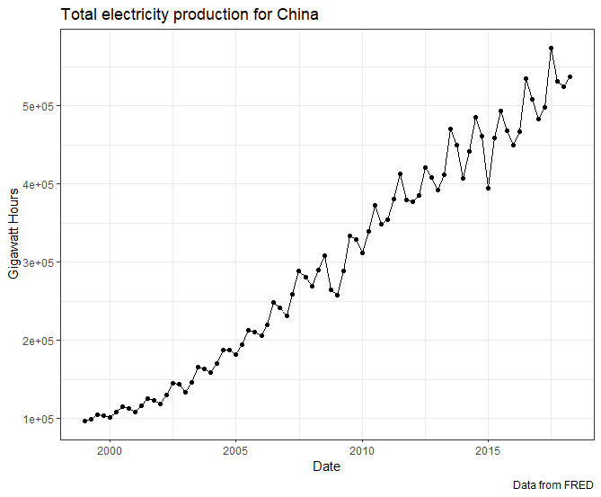
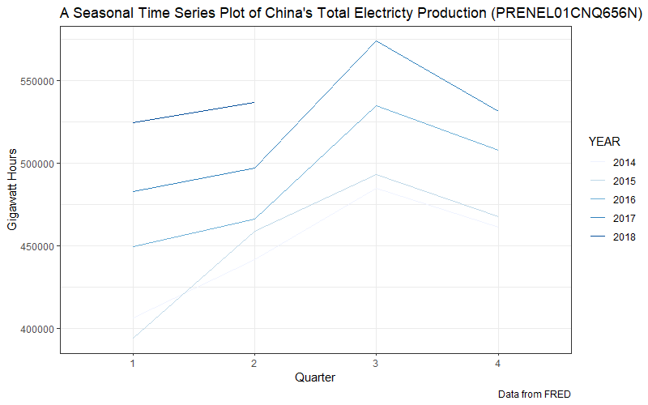

```{r setup, include=FALSE}
library(tidyverse)
library(tidyquant)
library(fpp2)
library(learnr)
library(ggfortify)
library(magrittr)
library(Tmisc)
tutorial_options(exercise.timelimit = 180)
```

## Welcome 

In this tutorial, you will review: (a) forecasting definitions and principles, and (b) the introductory statistical tools that are used for exploring time-series data. This tutorial is optional, but if you plan on completing it, you are advised to do the following prior to attempting the tutorial.   

1. Read chapters 1 and 2 from our textbook.  
2. Have completed all non-graded and graded assignments on our Canvas site.  
3. Be able to dedicate about an hour to go through this entire tutorial.

**Please close this tab after completing the tutorial since I am being billed for virtual machine useage on the shinyapps.io site.**


## Introduction

Based on [our textbook](https://www.wessexlearning.org/pobf2e/index.html), a **forecast** *is a prediction or estimate of an actual outcome expected in a future time period or for another situation.*   
  - *The purpose of forecasting is to inform the process of planning.*  
  - *The purpose of planning is to develop a course of action so that things don't “just continue” based on a no-change forecast.*


One of the important concepts from Week 01 was to distinguish between the terms: (a) cross-sectional data, (b) time-series data, and (c) panel data. Let us examine your understanding of these three terms.

```{r cross-sectional, echo=FALSE}
question("Based on the concepts learned in class, you would classify the Fantasy Football Projections for QBs at: https://www.fantasypros.com/nfl/projections/qb.php as",
  answer("Cross-sectional data",  correct = TRUE),
  answer("Time-series data", message = "It is not a time series since the data is aggregated for the entire 2020 season."),
  answer("Panel data", message = "Panel data involves several cross sectional measurements repeated over time. This answer is incorrect since we only have one time period here (the 2020 NFL season in its entirty)"),
  allow_retry = TRUE
)
```


In the R chunk below, please read the data from [Grunfeld's Investment Dataset](http://people.stern.nyu.edu/wgreene/Econometrics/grunfeld.csv), store the data in a data.frame titled `grunfeld`, and print the data.frame.
```{r exercise1, exercise=TRUE, excercise.eval= TRUE}

```

```{r exercise1-solution}
grunfeld = read.csv("http://people.stern.nyu.edu/wgreene/Econometrics/grunfeld.csv")
grunfeld
```

```{r panel, echo=FALSE}
question("By inspecting the rows (note the multiple pages) from the printed object above, grunfeld represents",
  answer("Cross-sectional data",  message = "We do not define this as cross sectional given that the data is collected repeatedly over time."),
  answer("Time-series data", message = "It captures 10 firms, where their investments (I), real value (F) and stocks' value (C) are provided. Thus, it should be considered as a panel dataset since it combines features of both cross sectional data and time series data."),
  answer("Panel data", correct = TRUE),
  allow_retry = TRUE
)
```

Please extract the following series `PRENEL01CNQ656N` from FRED into R, and recreate the graph below. 


```{r exercise2, exercise=TRUE, excercise.eval= TRUE}


```

```{r exercise2-hint-1}
cat("You may want to visit this FRED page: https://fred.stlouisfed.org/series/PRENEL01CNQ656N")
```

```{r exercise2-hint-2}
cat("You may want to visit this FRED page https://fred.stlouisfed.org/series/PRENEL01CNQ656N, and click on the download button to get the data.")
```


```{r exercise2-solution}
tepc = read.csv("https://fred.stlouisfed.org/graph/fredgraph.csv?bgcolor=%23e1e9f0&chart_type=line&drp=0&fo=open%20sans&graph_bgcolor=%23ffffff&height=450&mode=fred&recession_bars=off&txtcolor=%23444444&ts=12&tts=12&width=1168&nt=0&thu=0&trc=0&show_legend=yes&show_axis_titles=yes&show_tooltip=yes&id=PRENEL01CNQ656N&scale=left&cosd=1999-01-01&coed=2018-04-01&line_color=%234572a7&link_values=false&line_style=solid&mark_type=none&mw=3&lw=2&ost=-99999&oet=99999&mma=0&fml=a&fq=Quarterly&fam=avg&fgst=lin&fgsnd=2009-06-01&line_index=1&transformation=lin&vintage_date=2020-09-04&revision_date=2020-09-04&nd=1999-01-01")
tepc$DATE %<>% ymd()

tepc %>% ggplot(aes(x= DATE, y = PRENEL01CNQ656N)) +
  geom_line() + geom_point() +
  labs(title = "Total electricity production for China", y = "Gigawatt Hours", x = "Date", 
       caption = "Data from FRED") + theme_bw()
```

```{r tsplotInterpret, echo=FALSE}
question("From the graph above, we can describe this dataset as: [Select all that apply]",
  answer("Seasonal", correct = TRUE),
  answer("One with increasing trend", correct = TRUE),
  answer("Cyclical", message = "The trend is consistent so it is seasonal and not cyclical."),
  allow_retry = TRUE
)
```


## Seasonal Plots

Based on both the [FRED plot](https://fred.stlouisfed.org/series/PRENEL01CNQ656N) and your ggplot in the previous question, you should have been able to deduce that the series exhibits seasonality with $m=4$. In class, we have indicated that such data can be better shown using a seasonal plot. Therefore, please build on the code below to create the following seasonal plot.



```{r exercise3, exercise=TRUE, excercise.eval= TRUE}
tepc = read.csv("https://fred.stlouisfed.org/graph/fredgraph.csv?bgcolor=%23e1e9f0&chart_type=line&drp=0&fo=open%20sans&graph_bgcolor=%23ffffff&height=450&mode=fred&recession_bars=off&txtcolor=%23444444&ts=12&tts=12&width=1168&nt=0&thu=0&trc=0&show_legend=yes&show_axis_titles=yes&show_tooltip=yes&id=PRENEL01CNQ656N&scale=left&cosd=1999-01-01&coed=2018-04-01&line_color=%234572a7&link_values=false&line_style=solid&mark_type=none&mw=3&lw=2&ost=-99999&oet=99999&mma=0&fml=a&fq=Quarterly&fam=avg&fgst=lin&fgsnd=2009-06-01&line_index=1&transformation=lin&vintage_date=2020-09-04&revision_date=2020-09-04&nd=1999-01-01")
tepc$DATE %<>% ymd()

```

```{r exercise3-hint-1}
cat("You may want to capitalize on the lubridate package's built in functions
    to extract both the year and the quarter.")
```

```{r exercise3-hint-2}
cat("In ggplot, you may want to color and group by YEAR.")
```

```{r exercise3-solution}
tepc$YEAR = year(tepc$DATE)
tepc$QUARTER = quarter(tepc$DATE)

tepc %>% filter(YEAR >= 2014) %>% 
  mutate(YEAR = as.factor(YEAR)) %>% 
  ggplot(aes(x = QUARTER, y = PRENEL01CNQ656N, color = YEAR, group = YEAR)) +
  geom_line() +
  labs(x = "Quarter", y = "Gigawatt Hours", 
       title = "A Seasonal Time Series Plot of China's Total Electricty Production (PRENEL01CNQ656N)",
       caption = "Data from FRED") + theme_bw() +
  scale_x_discrete(limits = factor(seq(1,4, 1)) ) +
  scale_color_brewer(type = "seq", palette = "Blues")
```


## Data Summaries

In class, we have spent a considerable amount of time discussing measures for summarizing time-series and cross-sectional datasets. Based on the initial code below, please reconstruct the following table.

```{r anscombe, echo=FALSE, message=FALSE}
df = quartet %>% group_by(set) %>% 
  summarise(x.mean = mean(x), x.sd = sd(x),
            y.mean = mean(y), y.sd = sd(y),
            corr = cor(x, y))
df
```

```{r exercise4, exercise=TRUE, excercise.eval= TRUE}
df = quartet 
```

```{r exercise4-solution}
df = quartet %>% group_by(set) %>% 
  summarise(x.mean = mean(x), x.sd = sd(x),
            y.mean = mean(y), y.sd = sd(y),
            corr = cor(x, y))
print(df)
```


## Transformations

Based on the dataset below, compute the number of **new daily cases per county** and store it in a variable titled `newCases` (within `ohCOVID`). Note that:   

- The data is already grouped by id.
- The confirmed cases column represents the cumulative cases to date per county.  
- To preserve the grouping, please construct the new variable using `mutate()` as a part of your pipeline.

```{r exercise5, exercise=TRUE, excercise.eval= TRUE}
ohCOVID = readRDS("ohCovid.rds") %>% select(id, key_google_mobility, date, confirmed)
head(ohCOVID, 20) # printing the top 20 rows for your inspection

```

```{r exercise5-solution}
ohCOVID %<>% mutate(newCases = c(NA, diff(confirmed)) )
```

```{r ex5, echo=FALSE}
question("Is the solution from the following two lines of code equal (ignore different variable names -- only done to allow comparison)? \n
         ohCOVID$newCases2 = c(NA, diff(ohCOVID$confirmed) ). \n
         ohCOVID %<>% mutate(newCases = c(NA, diff(confirmed)) )",
  answer("Yes",  message = "Check the filtered data on 2020-03-01"),
  answer("No", correct = TRUE),
  allow_retry = TRUE
)
```

