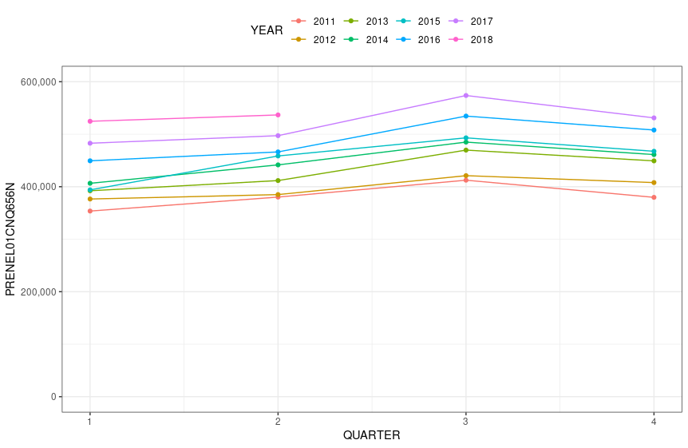

```{r setup, include=FALSE}
library(tidyverse)
library(tidyquant)
library(fpp2)
library(learnr)
library(ggfortify)
library(magrittr)
library(Tmisc)
library(scales)
tutorial_options(exercise.timelimit = 180)
```

## Welcome 

In this tutorial, you will review **some of the introductory statistical tools** that are used for exploring time-series data. This tutorial is optional, but if you plan on completing it, you are advised to do the following prior to attempting the tutorial.   

1. Read chapters 1 and 2 from our textbook.  
2. Have completed all non-graded and graded assignments on our Canvas site.  
3. Be able to dedicate about 30-50 minutes to go through this entire tutorial.


## Seasonal Plots


Based on the [FRED plot](https://fred.stlouisfed.org/series/PRENEL01CNQ656N), you should have been able to deduce that: (a) the series exhibits seasonality with $m=4$, and (b) the series exhibits an upward trend. In class, we have indicated that seasonal data can be confirmed using a seasonal plot (or through decomposing the series). In this exercise, we will focus on creating a seasonal plot. Build on the code below to create the following seasonal plot.



```{r exercise3, exercise=TRUE, excercise.eval= TRUE}
tepc = read.csv("https://fred.stlouisfed.org/graph/fredgraph.csv?bgcolor=%23e1e9f0&chart_type=line&drp=0&fo=open%20sans&graph_bgcolor=%23ffffff&height=450&mode=fred&recession_bars=off&txtcolor=%23444444&ts=12&tts=12&width=1168&nt=0&thu=0&trc=0&show_legend=yes&show_axis_titles=yes&show_tooltip=yes&id=PRENEL01CNQ656N&scale=left&cosd=1999-01-01&coed=2018-04-01&line_color=%234572a7&link_values=false&line_style=solid&mark_type=none&mw=3&lw=2&ost=-99999&oet=99999&mma=0&fml=a&fq=Quarterly&fam=avg&fgst=lin&fgsnd=2009-06-01&line_index=1&transformation=lin&vintage_date=2021-02-03&revision_date=2021-02-03&nd=1999-01-01")
tepc$DATE %<>% ymd()

```

```{r exercise3-hint-1}
cat("You may want to capitalize on the lubridate package's built in functions
    to extract both the year and the quarter.")
```

```{r exercise3-hint-2}
cat("In ggplot, you may want to color and group by YEAR.")
```

```{r exercise3-solution}
tepc$QUARTER = quarter(tepc$DATE)
tepc$YEAR = year(tepc$DATE) %>% as.factor()

tepc%>% filter(YEAR %in% c('2011', '2012', '2013', '2014', '2015', '2016', '2017', '2018')) %>% 
  ggplot(aes(x = QUARTER, y = PRENEL01CNQ656N, color = YEAR, group = YEAR)) +
  geom_line() + geom_point() +
  scale_y_continuous(labels = comma, limits = c(0, 600000)) +
  theme_bw() + theme(legend.position = 'top')

```


## Data Summaries

In class, we have spent a considerable amount of time discussing measures for summarizing time-series and cross-sectional datasets. Based on the initial code below, please reconstruct the following table.

```{r anscombe, echo=FALSE, message=FALSE}
df = quartet %>% group_by(set) %>% 
  summarise(x.mean = mean(x), x.sd = sd(x),
            y.mean = mean(y), y.sd = sd(y),
            corr = cor(x, y))
df
```

```{r exercise4, exercise=TRUE, excercise.eval= TRUE}
df = quartet 
```

```{r exercise4-solution}
df = quartet %>% group_by(set) %>% 
  summarise(x.mean = mean(x), x.sd = sd(x),
            y.mean = mean(y), y.sd = sd(y),
            corr = cor(x, y))
print(df)
```


## Transformations

Based on the dataset below, compute the number of **new daily cases per county** and store it in a variable titled `newCases` (within `ohCOVID`). Note that:   

- The data is already grouped by id.
- The confirmed cases column represents the cumulative cases to date per county.  
- To preserve the grouping, please construct the new variable using `mutate()` as a part of your pipeline.

```{r exercise5, exercise=TRUE, excercise.eval= TRUE}
covidURL = "https://github.com/fmegahed/businessForecasting/blob/master/tutorials/ohCovid.rds?raw=true"
ohCOVID = url(covidURL, method = 'libcurl') %>% 
  readRDS() %>% select(id, key_google_mobility, date, confirmed)
head(ohCOVID, 20) # printing the top 20 rows for your inspection

```

```{r exercise5-solution}
ohCOVID %<>% mutate(newCases = c(NA, diff(confirmed)) )
```

```{r ex5, echo=FALSE}
question("Is the solution from the following two lines of code equal (ignore different variable names -- only done to allow comparison)? \n
         ohCOVID$newCases2 = c(NA, diff(ohCOVID$confirmed) ). \n
         ohCOVID %<>% mutate(newCases = c(NA, diff(confirmed)) )",
  answer("Yes",  message = "Check the filtered data on 2020-03-01"),
  answer("No", correct = TRUE),
  allow_retry = TRUE
)
```

