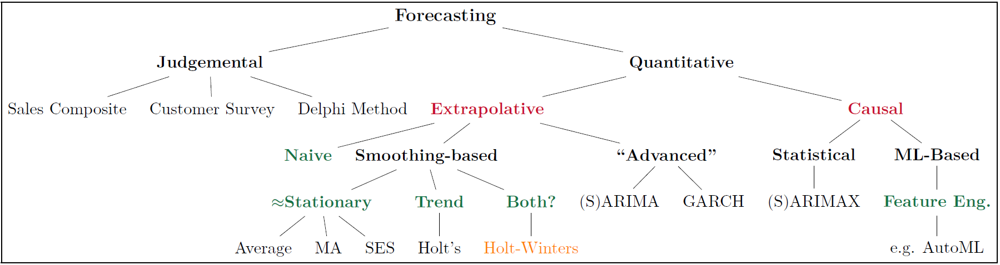

## Welcome 

In this tutorial, you will review **some of the decomposition, smoothing and forecasting methods** that are used for **seasonal** time-series data. This tutorial is optional, but if you plan on completing it, you are advised to do the following prior to attempting the tutorial.   

1. Thoroughly went through the slides and WebEx videos for classes 10 and 11.  
2. Read chapters 1, 2, 3.1-3.4, and 4 (with the exception of chapter 4.5) from our textbook.  
3. Be able to dedicate about 30 minutes to go through this entire tutorial.


**For your information, here are all the packages that are loaded with this tutorial.**
```{r setup, include=TRUE, verbose = FALSE, message=FALSE, warning=FALSE}
library(learnr) # used to convert my R Markdown into a tutorial
library(tidyverse)
library(tidyquant)
library(fpp2)
library(magrittr)
library(timetk)
library(plotly)
library(scales)
tutorial_options(exercise.timelimit = 600) # server sleeps with 10 min of inactivity
```


## Overview of Forecasting Methods

Over the past two class periods, we have focused on exponential smoothing techniques (SES and LES). That being said, it is **extremely important** to note lose focus of the big picture for forecasting methodologies since their performance, in practice, often depends on whether some of their assumptions are met. If they are not met, we either have to: (a) transform your data, or (b) utilize an alternative approach. *For your convenience, I am resharing the figure from [Class Notes 09 Slide 04](https://miamioh.instructure.com/courses/142177/modules) below.*

{width=100%}

Note that the focus of this tutorial is on **extrapolative: smoothing-based methods** that are suitable for **seasonal data**. 

## Seasonal Decomposition & Smoothing

A time series may be made up of:  
  - **Trends (T)** - upward and downward movements  
  - **Seasonal (S) components** - regular, recurrent patterns that repeat at a fixed known duration (period)  
  - **Error (E) components** - irregular “noise” that is randomly distributed over time
  

### Additive vs. Multiplicative Models

An **additive model** is appropriate when the trend is approximately linear, and the seasonal components stays constant over time. Mathematically, it can be represented as $Y = T + S + E$.

A **multiplicative model** is appropriate when the rate of change in the trend and/or the seasonal component and/or the variability in the error term increase or decrease over time. Mathematically, a fully multiplicative model can be represented as: $Y = TSE$. Note that such a model can be easily transformed to an additive model using a log transformation, i.e.:
$$
\begin{split}
Y & = TSE \\
\ln{(Y)} & = \ln{(TSE)} \\
 & = \ln{(T)} + \ln{(S)} + \ln{(E)}
\end{split}
$$
```{r multiAndAdditive, fig.keep='hold', out.width='50%', echo=FALSE}
retail = read.csv("https://fred.stlouisfed.org/graph/fredgraph.csv?bgcolor=%23e1e9f0&chart_type=line&drp=0&fo=open%20sans&graph_bgcolor=%23ffffff&height=450&mode=fred&recession_bars=on&txtcolor=%23444444&ts=12&tts=12&width=1168&nt=0&thu=0&trc=0&show_legend=yes&show_axis_titles=yes&show_tooltip=yes&id=RSXFSN&scale=left&cosd=2011-01-01&coed=2019-12-01&line_color=%234572a7&link_values=false&line_style=solid&mark_type=none&mw=3&lw=2&ost=-99999&oet=99999&mma=0&fml=a&fq=Monthly&fam=avg&fgst=lin&fgsnd=2020-02-01&line_index=1&transformation=lin&vintage_date=2020-09-28&revision_date=2020-09-28&nd=1992-01-01")
retail %>% ggplot(aes(x = ymd(DATE), y = RSXFSN)) +
  geom_line() + 
  labs(x=NULL,
       title = "Seasonality with an Additive Trend",
       caption = 'Data from FRED') +
  theme_bw(base_size = 10)


data("AirPassengers")
autoplot(AirPassengers) + 
  labs(x=NULL, title = "Seasonality w/ Multiplicative Trend: Non-linear & seasonal component grow w/ time",
       caption = 'AirPassengers R Dataset') +
  theme_bw(base_size = 10)
```


### Decomposition Methods 

Decomposition methods are used to “decompose” a time series into its components. Decomposition methods are generally poor forecasting methods, but they work well for:  
  - exploring and visualizing time series data  
  - detrending and/or deseasonalizing data  
  
Decomposition methods may be applied to **additive** or **multiplicative** time series. In R, we use the `decompose()` from base R (i.e., no extra packages are needed to decompose the time-series). Note that you need to specify the `type` input to reflect either *additive (default)* or *multiplicative*, and the input data to the `decompose()` needs to be a ts object, which is achieved using the function `ts()` from base R.


In the exercise below, you are expected to build on the code below to: (a) decide whether the time-series is *additive* or *multiplicative*, and (b) use the appropriate decomposition method to decompose the dataset.

```{r exercise5, exercise=TRUE, excercise.eval= TRUE}
beerProd = scan("https://online.stat.psu.edu/stat510/sites/stat510/files/data/beerprod.dat") %>% 
  ts(frequency = 4)
```

```{r exercise5-solution}
beerProd = scan("https://online.stat.psu.edu/stat510/sites/stat510/files/data/beerprod.dat") %>% 
  ts(frequency = 4)

# autoplot is easier than ggplot since the result from previous code is a time-series
# if you were to use ggplot -- you will need to convert beerProd to a df (with two columns)
# one for the beerProduction (which will be your y) and one corresponding to observation.Number/time (your x-axis)
beerProd %>% autoplot() + theme_bw() + 
  scale_x_date(breaks = scales::pretty_breaks(18)) + # we have 18 total periods (and it is a ts hence scale_x_date)
  labs(y = 'Beer Production', x = 'Time', title = 'An additive model (linear trend & seasonal variation is almost fixed)')

decompose(beerProd, type = "additive") %>% autoplot() + theme_bw()
```

### Important Note
We can use the output from `decompose(beerProd, type = 'additive') %>% .[['figure']]`. Based on our data, the seasonal factors are:

```{r sf, echo=FALSE}
beerProd = scan("https://online.stat.psu.edu/stat510/sites/stat510/files/data/beerprod.dat") %>% 
  ts(frequency = 4)

decompose(beerProd, type = 'additive') %>% .[['figure']]
```

Then, we can easily adjust the time-series by subtracting (we divide if we are using a multiplicative model) your observed data by the correct seasonal factor (i.e. if you are in Q4, you subtract by the Q4 SF).


### Holt-Winters Smoothing and Forecasting

If a time series has a linear trend with a local trend ( $\beta_1$, growth rate) and a local seasonal pattern ($SN_t$) that may be changing over time, we can use the Holt-Winters exponential smoothing method for forecasting to accommodate the seasonal pattern.


The Holt-Winters method accommodates time series data with a **local level**, a **local trend**, and a **local seasonal pattern**, all of which are slowly changing over time. There are both additive and multiplicative versions of the Holt-Winters method.

In R, we use the `hw()` (from the package [forecast](https://cran.r-project.org/web/packages/forecast/forecast.pdf) which can be either loaded using that package or it also gets loaded with [fpp2](https://cran.r-project.org/web/packages/fpp2/fpp2.pdf)) to smooth the time-series and obtain our forecasts. 

**As discussed in class, the Holt-Winters can be applied to both additive and multiplicative seasonal time-series**. 

In the code chunk below, use 60 from your 72 total observations (given freq of four you should attempt to pick an a training number divisible by four) to train both the seasonal and multiplicative Holt-Winters models (i.e., to optimize its parameters). Return the training and validation RMSE (and highlight the best model).

```{r exercise6, exercise=TRUE, excercise.eval= TRUE}
beerProd = scan("https://online.stat.psu.edu/stat510/sites/stat510/files/data/beerprod.dat") %>% 
  ts(frequency = 4)

```

```{r exercise6-solution}
beerProd = scan("https://online.stat.psu.edu/stat510/sites/stat510/files/data/beerprod.dat") %>% 
  ts(frequency = 4)

trainData = beerProd[1:60] %>% ts(frequency = 4) # ts() is needed to change it back to a time-series
hwAdd = hw(trainData, seasonal="additive")
hwMult = hw(trainData, seasonal="multiplicative")

trainingMetrics = rbind(accuracy(hwAdd), accuracy(hwMult))
row.names(trainingMetrics) = c('Additive HW Model', 'Multiplicative HW Model')
trainingMetrics # to print out the training results

# Using the optimal parameters for each model on the entire dataset
hwAddEntireData = hw(beerProd, alpha =  hwAdd$model$par['alpha'], beta =  hwAdd$model$par['beta'],
                     gamma =  hwAdd$model$par['gamma'], seasonal = 'additive')
hwMultEntireData = hw(beerProd, alpha =  hwMult$model$par['alpha'], beta =  hwMult$model$par['beta'],
                     gamma =  hwMult$model$par['gamma'], seasonal = 'multiplicative')

# Creating a data.frame with only the validation data (i.e. from 61 to 72)
validationData = data.frame(beer = beerProd[61:72],
                    add = hwAddEntireData %>% .[['fitted']] %>% .[61:72],
                    mult = hwMultEntireData %>% .[['fitted']] %>% .[61:72])

validationMetrics = rbind(accuracy(object = validationData$add, x = validationData$beer),
                          accuracy(object = validationData$mult, x = validationData$beer))
row.names(validationMetrics) = c('Additive HW Model', 'Multiplicative HW Model')
```