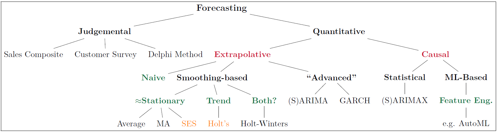

## Welcome 

In this tutorial, you will review **some of the smoothing and forecasting methods** that are used for **nonseasonal** time-series data. This tutorial is optional, but if you plan on completing it, you are advised to do the following prior to attempting the tutorial.   

1. Thoroughly went through the slides and WebEx videos for classes 07 and 09.  
2. Read chapters 1, 2 and 3.1-3.4 from our textbook.  
3. Be able to dedicate about 30-60 minutes to go through this entire tutorial.


**For your information, here are all the packages that are loaded with this tutorial.**
```{r setup, include=TRUE, verbose = FALSE, message=FALSE, warning=FALSE}
library(learnr) # used to convert my R Markdown into a tutorial
library(tidyverse)
library(tidyquant)
library(fpp2)
library(magrittr)
library(timetk)
library(plotly)
library(scales)
tutorial_options(exercise.timelimit = 600) # server sleeps with 10 min of inactivity
```


## Overview of Forecasting Methods

Over the past two class periods, we have focused on exponential smoothing techniques (SES and LES). That being said, it is **extremely important** to note lose focus of the big picture for forecasting methodologies since their performance, in practice, often depends on whether some of their assumptions are met. If they are not met, we either have to: (a) transform your data, or (b) utilize an alternative approach. *For your convenience, I am resharing the figure from [Class Notes 09 Slide 04](https://miamioh.instructure.com/courses/142177/modules) below.*

{width=100%}

Note that the focus of this tutorial is on **extrapolative: smoothing-based methods** that are suitable for **nonseasonal data**. 

## Smoothing/Forecasting Stationary TS

- **Cumulative average:** In our discussion in class, we stated that this represents the most basic smoothing approach. If you have a series that stays pretty constant over time, you could just constantly update the mean as you gain more information.  
  - **Assumptions:**  
    - Non-seasonal time-series  
    - Non-trending time-series
    - *Implicit:* A relatively small number of observations in the time-series since if $n$ is large than the impact of the last observation can be neglected.   
  - **R Function:** In class, we have combined `mutate()` and `cummean()` (both functions are from the [dplyr package](https://dplyr.tidyverse.org/)) to smooth the time-series.  
  
- **Rolling/Moving Average:** To overcome the limitation of the cumulative average, we have introduced the moving average with a window size of $k$. In this approach, the weight of each observation is $\frac{1}{k}$.     
  - **Assumptions:**  
    - Non-seasonal time-series  
    - Non-trending time-series   
  - **R Function:** In class, we have combined `mutate()` (which creates a new variable from the [dplyr package](https://dplyr.tidyverse.org/)) and  `rollmean()` (from the package [zoo](https://cran.r-project.org/web/packages/zoo/zoo.pdf) which can be either loaded using that package or it also gets loaded with [tidyquant](https://cran.r-project.org/web/packages/tidyquant/tidyquant.pdf)) to smooth the time-series.   

- **Simple Exponential Smoothing:** is a method used for one-step-ahead forecasting of a time series when there is no trend or seasonal pattern, but the mean may drift slowly over time.   
  - **Assumptions:**  
    - Non-seasonal time-series  
    - Non-trending time-series   
    - **However, the mean can drift slowly over time -- hence the term "local level".**  
  - **R Function:** In class, we have combined `mutate()` (which creates a new variable from the [dplyr package](https://dplyr.tidyverse.org/)) and  `ses()` (from the package [forecast](https://cran.r-project.org/web/packages/forecast/forecast.pdf) which can be either loaded using that package or it also gets loaded with [fpp2](https://cran.r-project.org/web/packages/fpp2/fpp2.pdf)) to smooth the time-series.  


### GDP Example from Class (Cont.)
In class, we have examined the GDP data from FRED, where I have showed you that the GDP grows exponentially over time. Hence, we **applied a log transformation to make the trend linear, and then differenced the logs to make the data more stationary.** Based on the log differenced series, we showed that the forecasts from the SES ($\alpha = 0.2$) results in a lower RMSE when compared to a MA(4), and the cumulative average forecasts (see slides 9-11 in Class Notes 09). 

In the exercise below, I would like you to identify the optimal $\alpha$. For the purpose of determining the optimal smoothing parameter, use the first 200 observations (~82% of data, note you will drop the first observation since it has NA) of the series for training. For the purpose of evaluating the goodness-of-fit on the out-of-sample observations, use the remaining 44 observations in the GDP series for validation. Compare the performance of the SES (with an optimal alpha) with that of the SES ($\alpha = 0.2$, and `initial = 'simple'`) for both the training and validation sets. 


```{r gdpSES, exercise=TRUE, excercise.eval= TRUE}
# obtaining the information based on the tq_get() from the tidyquant package
gdp = tq_get('GDP', get = 'economic.data', from = '1960-01-01') %>% 
  select(-symbol) # note I dropped the symbol column given that I extracted only one series

# Computing the log and then differencing the logs
gdp %<>% mutate(logGDP = log(price), 
                DeltaLogGDP = logGDP - lag(logGDP))
```

```{r gdpSES-solution}
gdp %<>% na.omit() # dropping the first observation

trainData = gdp[1:199,]
sesResults = ses(trainData$DeltaLogGDP, h = 1) # applying the ses function
optimalAlpha = sesResults$model$par['alpha']

gdp %<>% mutate(ses0.2 = ses(DeltaLogGDP, h = 8, level = 95, initial = 'simple', alpha = 0.2) %>% .[['fitted']],
                sesOpt = ses(DeltaLogGDP, h = 8, level = 95, initial = 'simple', alpha = optimalAlpha) %>% .[['fitted']]) 

trainData = gdp[1:199,]
validData = gdp[-c(1:199),]

results = rbind(accuracy(object = trainData$ses0.2, x = trainData$DeltaLogGDP),
                accuracy(object = trainData$sesOpt, x = trainData$DeltaLogGDP),
                accuracy(object = validData$ses0.2, x = validData$DeltaLogGDP),
                accuracy(object = validData$sesOpt, x = validData$DeltaLogGDP))

rownames(results) = c('train: SES (0.2)', 'train: SES (Opt)',
                      'valid: SES (0.2)', 'valid: SES (Opt)')
```

**Note that the SES(optimal) results are actually a bit worse on the training data than the manual approach using $\alpha = 0.2$. This can happen with any of the automated approaches, especially when you are using $\alpha$ values that are fairly close.**
  

## Non-Seasonal Smoothing w/ Trend

- **Linear Exponential Smoothing:** is a method used for one-step-ahead forecasting of a time series when there is a local trend, but nonseasonal pattern.   
  - **Assumptions:**  
    - Non-seasonal time-series  
    - A local **linear** trend is exhibited by the time-series   
    - **However, the overall trend can change slowly over time -- hence the term ``local''.**  
  - **R Function:** In class, we have used the `holt()` (from the package [forecast](https://cran.r-project.org/web/packages/forecast/forecast.pdf) which can be either loaded using that package or it also gets loaded with [fpp2](https://cran.r-project.org/web/packages/fpp2/fpp2.pdf)) to smooth the time-series. 
  
  
Based on the introduction above, please examine the `GDP` series on the [FRED Site](https://fred.stlouisfed.org/series/GDP) and set the dates to 1947-01-01 to 2020-01-01. Based on the interactive graph on the FRED site, please answer the following questions:

```{r tsplotInterpret4, echo=FALSE}
question("From the FRED plot, we can utilize holt method to smooth the trending time-series for GDP",
  answer("TRUE", message = 'We cannot directly apply holt method unless we log transform the data and observe a linear trend in the log-transform of the data'),
  answer("FALSE", correct = TRUE),
  allow_retry = FALSE
)
```

Based on the correct answer for the previous question, let us apply and optimize the LES approach on this data. Let us use data up to and including 2010-01-01 to obtain the optimal $\alpha$ and $\beta$. Then, report the accuracy metrics for the validation data.

```{r exercise4, exercise=TRUE, excercise.eval= TRUE}
gdp = read.csv('https://fred.stlouisfed.org/graph/fredgraph.csv?bgcolor=%23e1e9f0&chart_type=line&drp=0&fo=open%20sans&graph_bgcolor=%23ffffff&height=450&mode=fred&recession_bars=on&txtcolor=%23444444&ts=12&tts=12&width=1168&nt=0&thu=0&trc=0&show_legend=yes&show_axis_titles=yes&show_tooltip=yes&id=GDP&scale=left&cosd=1947-01-01&coed=2020-01-01&line_color=%234572a7&link_values=false&line_style=solid&mark_type=none&mw=3&lw=2&ost=-99999&oet=99999&mma=0&fml=a&fq=Quarterly&fam=avg&fgst=lin&fgsnd=2020-02-01&line_index=1&transformation=lin&vintage_date=2020-10-11&revision_date=2020-10-11&nd=1947-01-01')

gdp$DATE %<>%  ymd() # to convert from char to date + ymd() from lubridate and two-way pipe from magrittr
```


```{r exercise4-solution}
gdp = read.csv('https://fred.stlouisfed.org/graph/fredgraph.csv?bgcolor=%23e1e9f0&chart_type=line&drp=0&fo=open%20sans&graph_bgcolor=%23ffffff&height=450&mode=fred&recession_bars=on&txtcolor=%23444444&ts=12&tts=12&width=1168&nt=0&thu=0&trc=0&show_legend=yes&show_axis_titles=yes&show_tooltip=yes&id=GDP&scale=left&cosd=1947-01-01&coed=2020-01-01&line_color=%234572a7&link_values=false&line_style=solid&mark_type=none&mw=3&lw=2&ost=-99999&oet=99999&mma=0&fml=a&fq=Quarterly&fam=avg&fgst=lin&fgsnd=2020-02-01&line_index=1&transformation=lin&vintage_date=2020-10-11&revision_date=2020-10-11&nd=1947-01-01')

gdp$DATE %<>%  ymd() # to convert from char to date + ymd() from lubridate and two-way pipe from magrittr

# Log Transforming the Data
gdp$logGDP = log(gdp$GDP)

# Plot confirming that the log transform resulted in an acceptable linear trend on a local level
gdp %>% ggplot(aes(x = DATE, y = logGDP)) + # setting the x-axis and y-axis
  geom_line() + # drawing the line
  geom_smooth(method = 'lm', formula = y ~ x) + # optional showing that even the overall trend is a reasonable fit of data
  theme_bw() # making it a black and white theme

# Optimizing the Holt Parameters
trainData = gdp %>% filter(DATE <= '2010-01-01') %>% select(DATE, logGDP)
les = holt(trainData$logGDP) # from the forecast package
optAlpha = les$model$par['alpha'] # extracting optimal alpha from model
optBeta = les$model$par['beta'] # extracting optimal beta

# Using the optimal alpha and beta over the entire data (so we do not use initial values on validation Data)
gdp$les = holt(y = gdp$logGDP, alpha = optAlpha, beta = optBeta) %>% 
  .[['fitted']] # extracting the fit/smoothed values from the holt model object

# Plotting the Result
colors = c('logGDP' = 'black',
           'les' = 'red')
gdp %>% ggplot(aes(x = DATE)) +
  geom_line(aes(y = logGDP, color = 'logGDP')) +
   geom_line(aes(y = les, color = 'les')) + theme_bw() + theme(legend.position = 'bottom')


# Accuracy Metrics Only on Validation Data
validationData = filter(gdp, DATE > '2010-01-01') %>% # note that I did not include the equal sign since it is part of train
  select(DATE, logGDP, les)

accuracy(object = validationData$les, x = validationData$logGDP)
```
